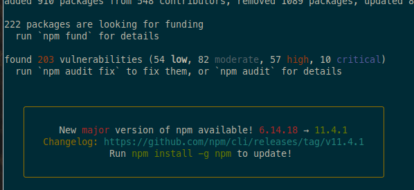
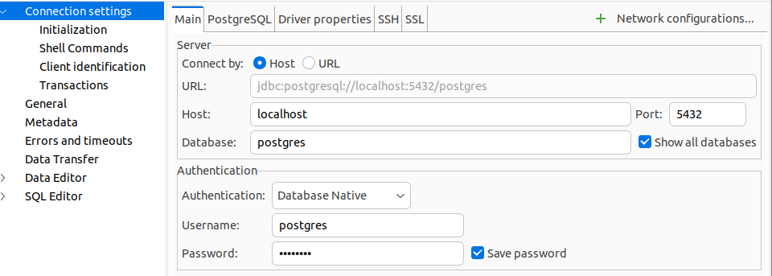

# Monorock

[Demo](https://monorock.web.app/)

A deployable monorepo by [Rockonsoft](https://rockonsoft.com/)

## Getting Started:

- You have a google cloud account with billing
- You are familiar with Google Cloud console and CLI
- You have node installed

### Local development

- [`$ git clone https://github.com/rockonsoft/monorock.git`]
- [`$ npm install`]
- Create PostgresSQL (Version 11) Database using console or CLI. Alternatively you can run PostgreSQL locally or with the V11 docker image.
- Create .env file and add database credentials:
- - DB_ENV=development
- - DB_PWD={{password}}
- Download key file App Engine default service account from GCP IAMS|Service Accounts:
- - Set GOOGLE_APPLICATION_CREDENTIALS=key.json in .env
- Create Firebase application and create a web app
- Get Client Id and secret from Cloud Console:
  - CLIENT_ID=
  - CLIENT_SECRET= in .env
- Create database tenant0 in Google Cloud Platform | SQL
- Install and Run cloud_sql_proxy
- (Uncomment lines 59-61 in apps\api\src\app\hosted-app\hosted-app.module.ts on the first run - this is to allow TypeOrm to create data tables before trying to seed database)
- In firebase console, enable anonymous and Google Authentication
- ng serve api to start api
- create apps\rockme\src\environments\environment.ts from sample provided and firebase web app config.
- build stylesheets with sass apps/sass/theme.scss .\apps\rockme\src\assets\theme.css
- ng serve rockme to start front end
- browse to localhost:4200 to see application

## Documentation

Monorock is a monorepo that features:

- Nestjs API deployable to Google Cloud Run
- Angular Frontend, deployable to firebase
- Continuous build and integration with Google Cloud Build
- CRUD operations with RBAC on PostgreSQL database

## PostgreSQL and TypeOrm

- running the local proxy: cloud_sql_proxy -instances=projectId:location:instanceName=tcp:5432, e.g: cloud_sql_proxy.exe -instances=monorock:us-east1:monorock=tcp:5432

## Client Authentication

- Enable anonymous login in Firebase Project
- Get Firebase project settings and add to environments
- Encode environment file, to be decrypted during build

## CI / DI with Google Cloud build

Include is a build chain to enable automatic build and deploy on changes to the repository.
The current solution wat tested with the GitHub integration. Direct integrations are possible with Bitbucket. It is also possible to allow access via a Cloud Source repository.

## Required IAMS

- KMS
- Cloud Run Admin

### Add your GitHub repo to Cloud Build

From the GCP console, go to Gloud Build | Settings | Add Repository, then follow the simple instructions to configure access to the GitHub repo and create a push trigger.

### Build Tools

Building and deploying the project with Google Cloud Build requires that you create the following build tools (docker images in you project)

- Firebase Build tool
- Nrwl Buil tools

#### Firebase Build Tool

- [`firebase login:ci`]

To create the firebase build tool

- [`cd build_tool/firebase`]
- Change all the references to {PROJECT_ID} to your own project
- [`gcloud builds submit --config=cloudbuild.yaml . `]

#### Nrwl Build Tool

To create the Nrwl build tool

- [`cd build_tool/nrwl`]
- Change all the references to {PROJECT_ID} to your own project
- [`gcloud builds submit --config=cloudbuild.yaml . `]

#### Get the firebase token

- [`firebase login:ci`]
- Enable the KMS api
- Ensure you are in the using the correct project [`gcloud config set project ${PROJECT_ID}`]
- [`gcloud kms keyrings create monorock-integration-secrets --location global`]
- Create a file to store the secret .firebasetoken
- [`gcloud kms keys create monorock-firebase-token --location global --keyring monorock-integration-secrets --purpose encryption`]
- [`gcloud kms encrypt --plaintext-file=.firebasetoken --ciphertext-file=.firebasetoken.enc --location=global --keyring=monorock-integration-secrets --key=monorock-firebase-token`]
- Use output of [`gcloud kms keys list --location global --keyring monorock-integration-secrets`] add as kmsKeyName to cloudbuild.yaml
- Convert encoded value to base64 string [`base64 .firebasetoken.enc -w 0 > .firebasetoken.enc.txt`]

Once you Build Tools are created, update the cloudbuild.yaml to reference the tool. Then push changes to the repo or kick off a build manually.

### Skip CI Build

In such scenarios, you can include [skip ci] or [ci skip] in the commit message, and a build will not be triggered.

## Deploy

The API is deployed to Google Cloud run as a stateless service.
The Frontend is deployed to Firestore.

### Deploy API to GCP

- Create an GCP project with billing enabled(PROJECT_ID)
- [`gcloud config set project {PROJECT_ID}]`]

#### Build

- [`ng build api`]
- Run pre-build steps, (only needed after clean build) [`npm run-script prebuild:apijson`], [`npm run-script prebuild:apidocker`], [`npm run-script prebuild:apipackage`]
- [`cd /dist/apps/api`]
- [`gcloud builds submit --tag gcr.io/{PROJECT_ID}/monorock-api`]

#### Manual Deploy

Deploy the API to Cloud Run with:

- [`gcloud beta run deploy {servicename} --image gcr.io/{PROJECT_ID}/monorock-api --allow-unauthenticated --update-env-vars NODE_ENV=production`]
- Test the API by navigating to the url generated by the service: {serviceurl}/api/hello

### Deploy Frontend to Firestore:

- Initialize project in Firestore console. (Project is shared with GCP)
- [`firestore init`] Initialise firetore for hosting only. set public folder to dist/apps/rockme

#### Build

- [`ng build rockme`]

#### Manual Deploy

- [`firebase deploy --only hosting`]
- In order to connect the frontend to the API, ensure that the rewrite rule is in firebase.json

### Test Manual Deploy

Go to the url returned from the firebase command (or specified in the firebase console).
You should now see the basic Nrwl app and welcome message from the API

# Documentation as generated by Nrwl

This project was generated using [Nx](https://nx.dev).

<p align="center"></p>

🔎 **Nx is a set of Extensible Dev Tools for Monorepos.**

## Quick Start & Documentation

[Nx Documentation](https://nx.dev/angular)

[10-minute video showing all Nx features](https://nx.dev/angular/getting-started/what-is-nx)

[Interactive Tutorial](https://nx.dev/angular/tutorial/01-create-application)

## Adding capabilities to your workspace

Nx supports many plugins which add capabilities for developing different types of applications and different tools.

These capabilities include generating applications, libraries, etc as well as the devtools to test, and build projects as well.

Below are some plugins which you can add to your workspace:

- [Angular](https://angular.io)
  - `ng add @nrwl/angular`
- [React](https://reactjs.org)
  - `ng add @nrwl/react`
- Web (no framework frontends)
  - `ng add @nrwl/web`
- [Nest](https://nestjs.com)
  - `ng add @nrwl/nest`
- [Express](https://expressjs.com)
  - `ng add @nrwl/express`
- [Node](https://nodejs.org)
  - `ng add @nrwl/node`

## Generate an application

Run `ng g @nrwl/angular:app my-app` to generate an application.

> You can use any of the plugins above to generate applications as well.

When using Nx, you can create multiple applications and libraries in the same workspace.

## Generate a library

Run `ng g @nrwl/angular:lib my-lib` to generate a library.

> You can also use any of the plugins above to generate libraries as well.

Libraries are sharable across libraries and applications. They can be imported from `@monorock/mylib`.

## Development server

Run `ng serve my-app` for a dev server. Navigate to http://localhost:4200/. The app will automatically reload if you change any of the source files.

## Code scaffolding

Run `ng g component my-component --project=my-app` to generate a new component.

## Build

Run `ng build my-app` to build the project. The build artifacts will be stored in the `dist/` directory. Use the `--prod` flag for a production build.

## Running unit tests

Run `ng test my-app` to execute the unit tests via [Jest](https://jestjs.io).

Run `nx affected:test` to execute the unit tests affected by a change.

## Running end-to-end tests

Run `ng e2e my-app` to execute the end-to-end tests via [Cypress](https://www.cypress.io).

Run `nx affected:e2e` to execute the end-to-end tests affected by a change.

What worked for me:`ng e2e rockme-e2e --no-exit`

## Understand your workspace

Run `nx dep-graph` to see a diagram of the dependencies of your projects.

## Further help

Visit the [Nx Documentation](https://nx.dev/angular) to learn more.

## Refresh August 2025

This repo has been neglected for a while, and it's time to give it some love. Let's update the dependencies, improve the documentation, and ensure everything is working smoothly.

### Development Environment Setup

- Running npm install to update dependencies
  

- Starting the PostGres container:

```bash
docker compose up -d postgres
```

This creates the database server with the default user and password as specified in the docker-compose.yml file.

The compose file use to install PgAdmin4, but now I just use DBeaver for database management.
The DBeaver connection settings are as follows:


### Todos

- [ ] Update dependencies to the latest versions
- [ ] Improve documentation for better clarity
- [ ] Upgrade Angular and Nx to the latest versions
